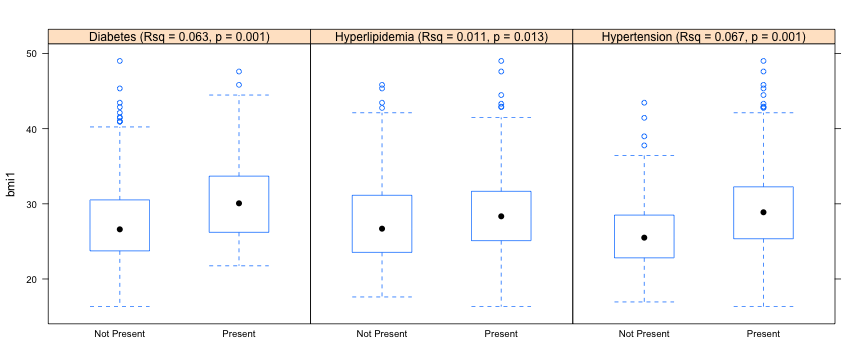

## Background

-   The body mass index (BMI) is a simple function of height and weight
-   It has been widely used to quantify obesity
-   There are many studies showing a relationship of BMI with various health outcomes including   
    -   Diabetes
    -   Hypertension
    -   Heart Disease
    -   Cancer

---

## Associations of BMI with Diabetes, Hypertension, and Hypercholesterolemia

Association of Body Mass Index (BMI) with common cardiovascular risk factor in a racially/ethnically diverse sample from a longitudinal study of cognitive aging. Participants are 60+ years of age. Results show significant associations of BMI with all three diagnoses. While these associations are relatively weak, they correspond to large population effects.

 

---

##  BMI Calculation

-   BMI can be calculated using Metric or English units for measuring height or weight
-   The formula for Metric measurement units is:

$$\frac{weight_{kilograms}}{height_{meters}^2}$$

- The formula for English measurement units is:

$$\frac{weight_{pounds} x 703}{height_{inches}^2}$$

---

##  BMI Calculator Program

A simple BMI calculator program will allow users to quickly calculate BMI values.  

This program can be accessed at: https://dmungas.shinyapps.io/BMI_Calc

To calculate the BMI associated with a specific height and weight: 1) select units 
of measurement for height and weight (English versus Metric), 2) enter height (in 
appropriate units) in dropdown menu, and 3) enter weight (in appropriate units)
in dropdown menu. The calculated BMI value will be displayed.

